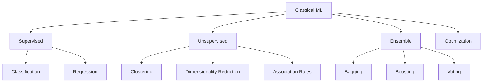
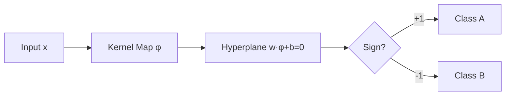
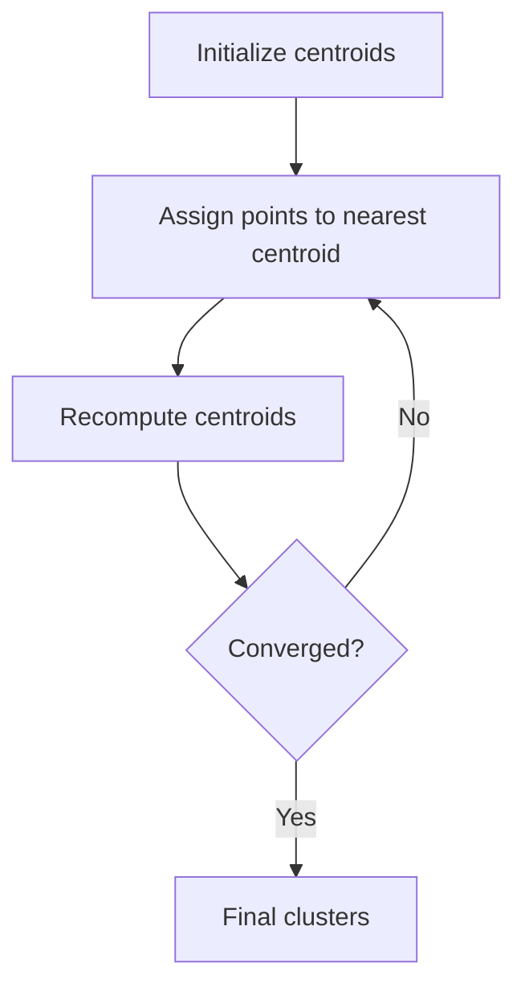
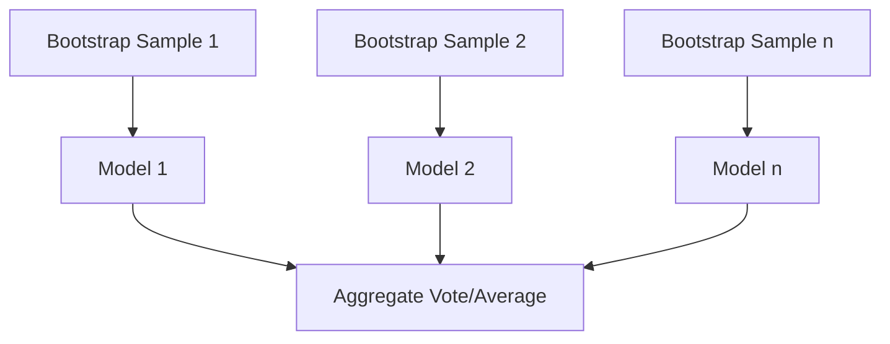

# Classical Machine Learning — From Scratch

Every major classical ML algorithm implemented in pure Python with NumPy. Each has a standalone `.py` file and an accompanying notebook.

---

## Architecture Overview



---

## Supervised Learning

### Classification

| Algorithm | Key Formula | Notebook |
|-----------|------------|----------|
| **Logistic Regression** | $P(y=1 \mid x) = \frac{1}{1 + e^{-(\beta_0 + \beta_1 x)}}$ | [[notebook]](logistic_regression_example.ipynb) |
| **SVM** | Maximize margin $\frac{2}{\|w\|}$ s.t. $y_i(w^T x_i + b) \geq 1$ | [[notebook]](svm_example.ipynb) |
| **KNN** | Classify by majority vote of $k$ nearest neighbors | [[notebook]](knn_example.ipynb) |
| **Naive Bayes** | $P(y \mid x_1,...,x_n) \propto P(y) \prod_i P(x_i \mid y)$ | [[notebook]](naive_bayes_example.ipynb) |
| **Decision Trees** | Split on max Information Gain or min Gini Impurity | [[notebook]](decision_trees_example.ipynb) |



### Regression

| Algorithm | Objective | Notebook |
|-----------|----------|----------|
| **Linear Regression** | $\min \|y - X\beta\|^2$ | [[notebook]](linear_regression_example.ipynb) |
| **Ridge** | $\min(\|y - X\beta\|^2 + \lambda\|\beta\|_2^2)$ | [[notebook]](ridge_regression_example.ipynb) |
| **Lasso** | $\min(\|y - X\beta\|^2 + \lambda\|\beta\|_1)$ | [[notebook]](lasso_regression_example.ipynb) |
| **Elastic Net** | $\min(\|y - X\beta\|^2 + \lambda_1\|\beta\|_1 + \lambda_2\|\beta\|_2^2)$ | [[notebook]](elastic_net_example.ipynb) |
| **Gaussian Process** | $f(x) \sim \mathcal{GP}(m(x),\; k(x, x'))$ | [[notebook]](gaussian_process_example.ipynb) |


---

## Unsupervised Learning

### Clustering

| Algorithm | Core Idea | Notebook |
|-----------|----------|----------|
| **K-Means** | $\min \sum_{i=1}^k \sum_{x \in S_i} \|x - \mu_i\|^2$ | [[notebook]](kmeans_example.ipynb) |
| **Hierarchical** | Agglomerative (bottom-up) or Divisive (top-down) dendrogram | [[notebook]](hierarchical_clustering_example.ipynb) |
| **DBSCAN** | Density-based: $\epsilon$-neighborhood + MinPts threshold | [[notebook]](dbscan_example.ipynb) |
| **GMM** | $p(x) = \sum_{k=1}^K \pi_k \mathcal{N}(x \mid \mu_k, \Sigma_k)$ | [[notebook]](gaussian_mixture_example.ipynb) |



### Dimensionality Reduction

| Algorithm | Approach | Notebook |
|-----------|---------|----------|
| **PCA** | Maximize variance: $\text{Var}(X^T w)$ s.t. $\|w\| = 1$ | [[notebook]](pca_example.ipynb) |
| **t-SNE** | Minimize KL divergence between high/low-dim distributions | [[notebook]](tsne_example.ipynb) |
| **UMAP** | Optimize fuzzy topological representation in low-dim space | [[notebook]](custom_umap_example.ipynb) |

### Association Rules

| Algorithm | Metrics | Notebook |
|-----------|---------|----------|
| **Apriori** | Support, Confidence, Lift | [[notebook]](apriori_example.ipynb) |

---

## Ensemble Methods



**Boosting:**


| Algorithm | Key Formula | Notebook |
|-----------|------------|----------|
| **Random Forests** | Bagging + random feature subsets per split | [[notebook]](random_forests_example.ipynb) |
| **AdaBoost** | $F_T(x) = \sum_{t=1}^T \alpha_t h_t(x)$ | [[notebook]](adaboost_example.ipynb) |
| **Gradient Boosting** | $F_m(x) = F_{m-1}(x) + \gamma_m h_m(x)$ | [[notebook]](gradient_boosting_example.ipynb) |
| **XGBoost** | $\text{Obj} = \sum_i l(y_i, \hat{y}_i) + \sum_k \Omega(f_k)$ | [[notebook]](xgboost_example.ipynb) |
| **Voting Classifier** | Hard (majority) or Soft (probability average) | [[notebook]](voting_example.ipynb) |
| **Bagging** | Bootstrap aggregating with replacement | [[notebook]](bagging_example.ipynb) |

---

## Optimization & Evaluation

| Algorithm | Update Rule | Notebook |
|-----------|------------|----------|
| **Gradient Descent** | $\theta = \theta - \alpha \nabla J(\theta)$ | [[notebook]](gradient_descent_example.ipynb) |
| **Grid Search** | Exhaustive search over hyperparameter grid | [[notebook]](grid_search_example.ipynb) |

## Anomaly Detection

| Algorithm | Method | Notebook |
|-----------|--------|----------|
| **Isolation Forest** | Anomaly score from average path length in random trees | [[notebook]](isolation_forest_example.ipynb) |

---

## Usage

```python
from svm import SVM

model = SVM(kernel='rbf', C=1.0)
model.fit(X_train, y_train)
predictions = model.predict(X_test)
```

Each `.py` file is self-contained. Notebooks show full training loops with visualizations.

---

## License

MIT
